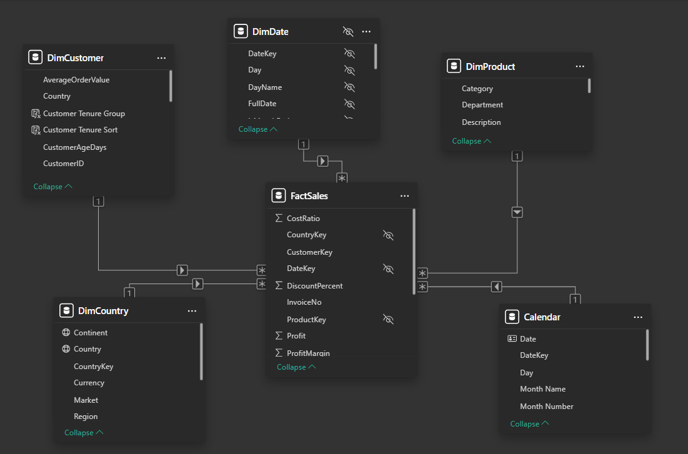
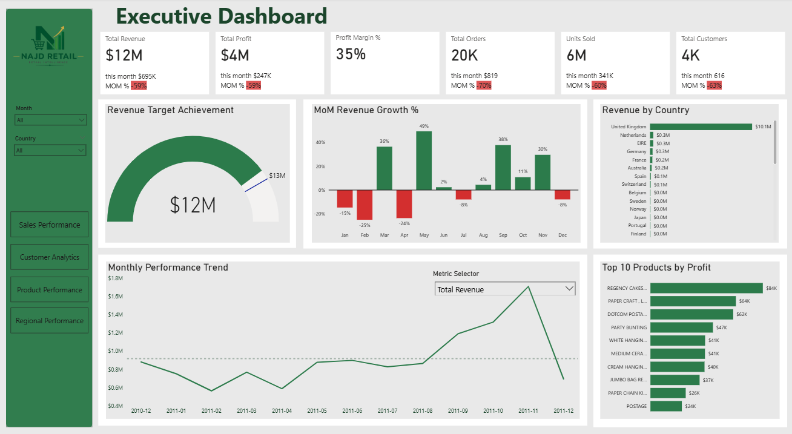
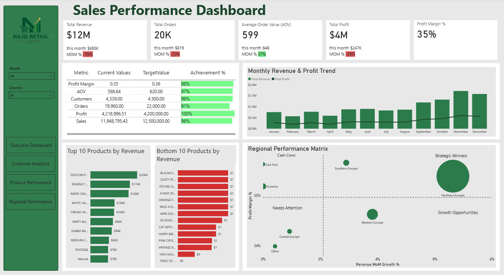
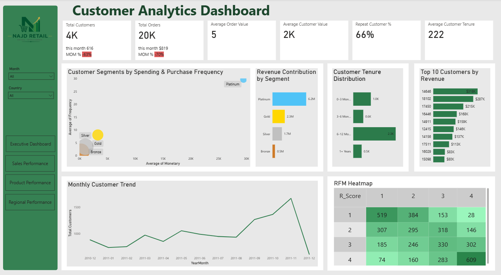
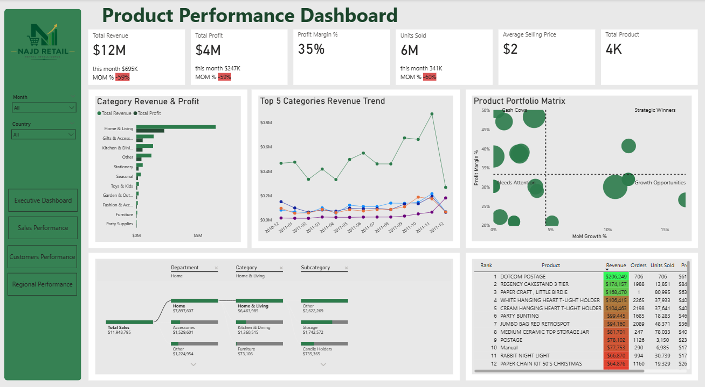
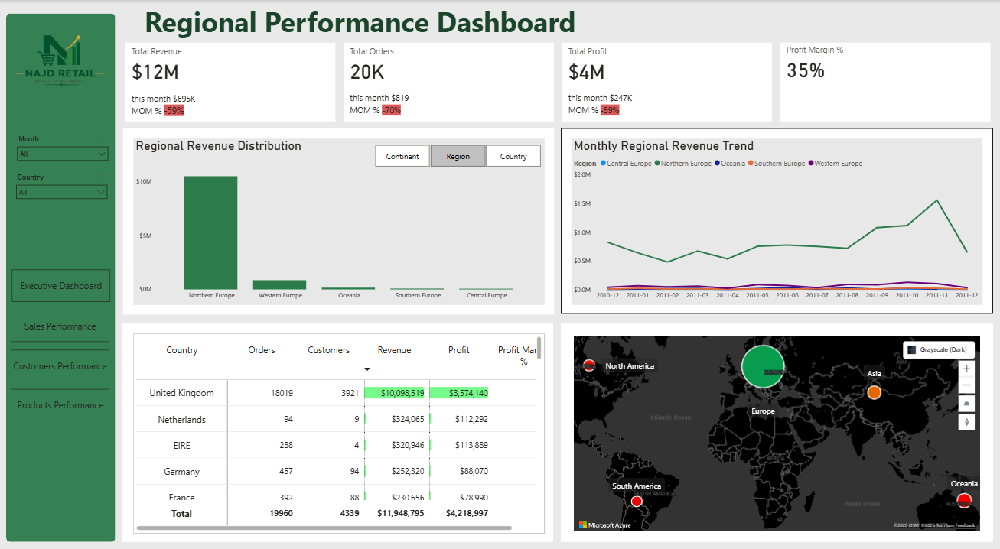

# Saudi Retail Intelligence Dashboard

An end-to-end retail analytics project built to analyze sales, customers, products, and regional performance using **Python, SQL Server, and Power BI**.

The project simulates a retail business environment and demonstrates the complete analytics workflow — from raw data preparation and business-rule-based feature engineering to data warehousing, SQL validation, and interactive Power BI dashboards.

---

## 📊 Project Overview

**Najd Retail** is a fictional retail company used as the business scenario for this project.

The goal is to transform raw transactional data into actionable business insights across four key areas:

- Sales Performance
- Customer Analytics
- Product Performance
- Regional Performance

The project follows an end-to-end data analytics workflow:

**Raw Data → Python → SQL Server Data Warehouse → Power BI → Business Insights**

---

## 🛠️ Technologies & Tools

### Python

- Pandas
- NumPy
- Data Cleaning
- Feature Engineering
- Business Rule Generation
- RFM Analysis
- Data Validation
- SQL Server Data Loading using PyODBC

### SQL Server

- Star Schema
- Fact Table
- Dimension Tables
- Data Warehouse
- SQL Queries
- Data Validation

### Power BI

- Data Modeling
- DAX
- Interactive Dashboards
- KPI Analysis
- Drill-down Analysis
- Conditional Formatting
- Dynamic Metric Selection
- Azure Maps

### GitHub

- Project Documentation
- Version Control
- Portfolio Presentation

---

## 🏗️ Data Architecture

The project uses a **Star Schema** data warehouse designed for analytical reporting.

### Data Model

The Power BI model connects the central `FactSales` table with the main dimension tables:



### Fact Table

- `FactSales`

### Dimension Tables

- `DimDate`
- `DimCustomer`
- `DimProduct`
- `DimCountry`

The warehouse is stored in SQL Server under the database:

`RetailAnalyticsDW_v2`

The warehouse tables were **created and loaded using Python**, specifically through the SQL loading notebook using **PyODBC**.

SQL Server is then used to store, query, and validate the final analytical warehouse.

---

## 🔄 End-to-End Data Pipeline

The project follows an end-to-end analytics pipeline that transforms raw transactional data into a structured analytical data warehouse and interactive business dashboards.

```text
Raw Retail Dataset
        │
        ▼
┌─────────────────────────┐
│ 1. Load Raw Data        │
│ Python / Pandas         │
└────────────┬────────────┘
             │
             ▼
┌─────────────────────────┐
│ 2. Data Cleaning        │
│ Missing values          │
│ Duplicates              │
│ Invalid transactions    │
│ Cancelled orders        │
└────────────┬────────────┘
             │
             ▼
┌─────────────────────────┐
│ 3. Feature Engineering  │
│ Business rules          │
│ Sales & profit metrics  │
│ Customer features       │
│ Product features        │
│ RFM analysis            │
└────────────┬────────────┘
             │
             ▼
┌─────────────────────────┐
│ 4. Build Dimensions     │
│ DimDate                 │
│ DimCustomer             │
│ DimProduct              │
│ DimCountry              │
└────────────┬────────────┘
             │
             ▼
┌─────────────────────────┐
│ 5. Build Fact Table     │
│ FactSales               │
└────────────┬────────────┘
             │
             ▼
┌─────────────────────────┐
│ 6. SQL Server Warehouse │
│ RetailAnalyticsDW_v2    │
│ Star Schema             │
│ Loaded using Python     │
│ with PyODBC             │
└────────────┬────────────┘
             │
             ▼
┌─────────────────────────┐
│ 7. SQL Validation       │
│ Database verification   │
│ Row counts              │
│ Warehouse validation    │
└────────────┬────────────┘
             │
             ▼
┌─────────────────────────┐
│ 8. Power BI             │
│ Data Modeling           │
│ DAX Measures            │
│ Interactive Dashboards  │
└────────────┬────────────┘
             │
             ▼
       Business Insights
```

---

## 🧹 Data Preparation

The raw transactional data was processed using Python.

The data preparation workflow included:

- Loading the raw retail dataset
- Handling missing values
- Removing duplicate records
- Handling cancelled transactions
- Validating quantities and prices
- Creating business-rule-based features
- Generating discount percentages using business probabilities
- Calculating sales, cost, profit, and profit margin
- Creating customer segments
- Creating product categories
- Building customer RFM features
- Creating dimension tables
- Building the final `FactSales` table
- Validating the warehouse before loading it into SQL Server

---

## 🗄️ SQL Server Data Warehouse

The final analytical warehouse is stored in SQL Server using a Star Schema.

### Database

```text
RetailAnalyticsDW_v2
```

### Warehouse Tables

```text
FactSales
DimCustomer
DimProduct
DimDate
DimCountry
```

The warehouse was generated and loaded using Python.

The SQL layer is then used for querying and validation.

### SQL Validation

The project includes SQL validation queries to verify:

- Active database
- Dimension table row counts
- Fact table row count
- Successful warehouse loading

Example:

```sql
SELECT DB_NAME() AS CurrentDatabase;

SELECT COUNT(*) AS CountryRows
FROM DimCountry;

SELECT COUNT(*) AS DateRows
FROM DimDate;

SELECT COUNT(*) AS ProductRows
FROM DimProduct;

SELECT COUNT(*) AS CustomerRows
FROM DimCustomer;

SELECT COUNT(*) AS SalesRows
FROM FactSales;
```

---

## 📈 Power BI Dashboards

The project contains five interactive dashboards designed for different business perspectives.

### 1. Executive Dashboard

Provides a high-level overview of business performance.

Key areas include:

- Total Revenue
- Total Profit
- Profit Margin
- Total Orders
- Units Sold
- Total Customers
- Sales Target Achievement
- Monthly Sales & Profit Trends
- Revenue by Country
- Top Products by Profit



---

### 2. Sales Performance Dashboard

Focuses on overall sales performance and target achievement.

Key areas include:

- Revenue
- Orders
- Average Order Value
- Profit
- Profit Margin
- KPI Target Achievement
- Monthly Sales & Profit
- Top & Bottom Products
- Regional Performance Analysis



---

### 3. Customer Analytics Dashboard

Analyzes customer behavior, value, and segmentation.

Key areas include:

- Total Customers
- Total Orders
- Average Order Value
- Average Customer Value
- Repeat Customer Rate
- Customer Tenure
- Customer Segmentation
- Revenue Contribution by Segment
- Top Customers by Revenue
- RFM Analysis



---

### 4. Product Performance Dashboard

Provides detailed product and category analysis.

Key areas include:

- Revenue
- Profit
- Profit Margin
- Units Sold
- Average Selling Price
- Product Portfolio Analysis
- Category Sales & Profit
- Category Trends
- Top & Bottom Products
- Product Ranking



---

### 5. Regional Performance Dashboard

Analyzes business performance across geographic areas.

Key areas include:

- Regional Sales Distribution
- Monthly Regional Sales Trends
- Country-level Performance
- Orders and Customers by Country
- Revenue and Profit by Country
- Profit Margin Analysis
- Geographic Visualization using Azure Maps



---

## 🔍 Key Business Insights

The dashboards are designed to answer questions such as:

- How is overall revenue and profitability performing?
- Which products generate the most revenue and profit?
- Which customer segments contribute the most revenue?
- How many customers are repeat customers?
- Which countries and regions perform best?
- Which products or regions require attention?
- How close is the business to its performance targets?
- Which areas represent potential growth opportunities?

---

## 📁 Project Structure

```text
saudi-retail-intelligence-dashboard/
│
├── README.md
│
├── data/
│   ├── raw/
│   │   └── README.md
│   │
│   ├── processed/
│   │   └── README.md
│   │
│   └── warehouse/
│       └── README.md
│
├── notebooks/
│   ├── 01_Load_Data.ipynb
│   ├── 02_Data_Cleaning.ipynb
│   ├── 03_Feature_Engineering.ipynb
│   ├── 04_Generate_Dimensions.ipynb
│   ├── 05_Build_FactSales.ipynb
│   └── 06_Load_SQL_pyodbc.ipynb
│
├── sql/
│   ├── 01_Validation.sql
│   └── README.md
│
├── executive-dashboard.png
├── sales-performance-dashboard.png
├── customers-Performance-dashboard.png
├── products-performance-dashboard.png
└── regional-performance-dashboard.png
```

---

## 📌 Project Workflow Summary

```text
Raw Data
   ↓
Python Data Cleaning
   ↓
Feature Engineering
   ↓
Dimension & Fact Table Creation
   ↓
SQL Server Data Warehouse
   ↓
SQL Validation
   ↓
Power BI Data Model
   ↓
DAX & Interactive Dashboards
   ↓
Business Insights
```

---

## 🎯 Project Objective

This project demonstrates the ability to build a complete analytics solution rather than only creating Power BI visualizations.

It combines:

**Data Engineering + Data Analysis + SQL + Business Intelligence + Data Visualization**

to transform raw transactional data into a structured analytical solution that supports business decision-making.
